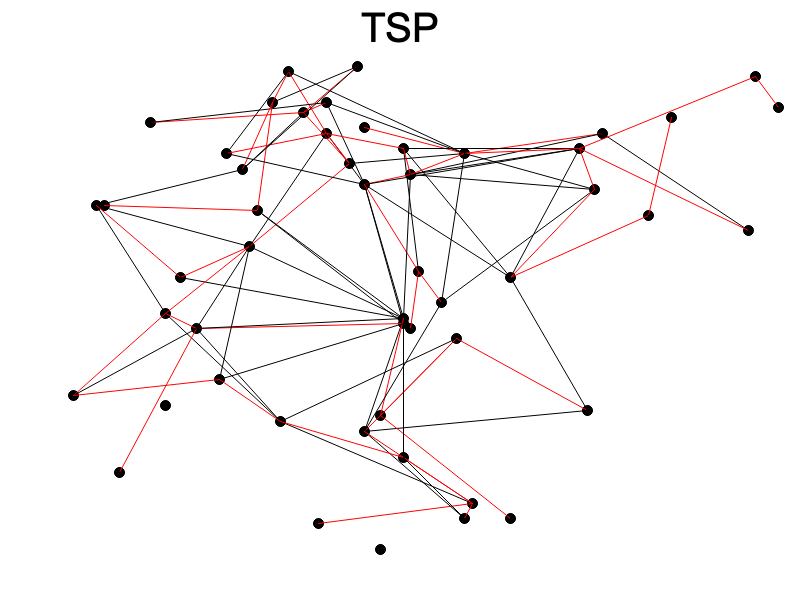

# travelling_salesman_problem

Given n cities, with distances d(u, v) between them (that satisfy the triangle inequality),
find the order to visit them that minimizes the length of the route.
Can think of input as a complete graph G with N^C_2 edges.

graph_lib library can generate a weighted undirected graph with unique edge weights containing a given number of vertices and edges

## Approaches

### Minimum Spanning Trees

#### Final solution

#### Animation
TODO

### Joint State Astar

#### Final solution
TODO

#### Animation
TODO

### Linear Programming

#### Final solution
TODO

#### Animation
TODO
